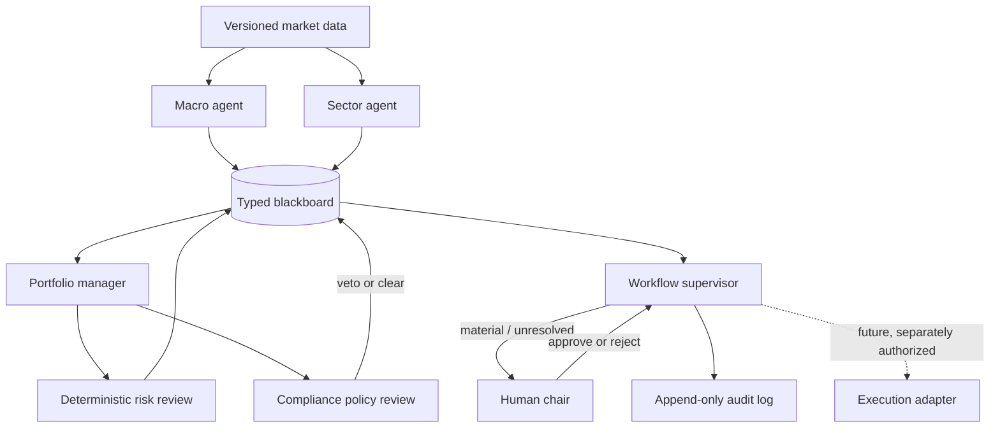

# Portfolio Committee MAS

A small, auditable multi-agent system that simulates a risk-constrained investment committee. It is not an autonomous trading system: specialist agents recommend and challenge, deterministic controls validate, and a human remains accountable for material decisions.

## Quick start

Requires Python 3.10+ and no runtime dependencies.

```bash
python3 -m portfolio_mas.demo
python3 -m unittest discover -s tests
```

The demo starts with a balanced portfolio, encounters an inflation shock, proposes an energy tilt containing a restricted security, records a compliance veto, revises the proposal, re-runs risk and compliance, obtains approval bound to the revised proposal and input snapshot hashes, and appends the complete interaction to a hash-chained audit log.

## System brief

**Use case.** Support a portfolio committee making a rebalance decision under macro uncertainty, portfolio constraints, and compliance rules.

**Stakeholders.** Portfolio manager, chief investment officer/committee chair, risk officer, compliance officer, clients/beneficiaries, regulators, and operations staff.

**Objective.** Produce an evidence-linked, mandate-compliant recommendation with visible disagreement and a reversible decision path. The prototype does not optimize or execute live trades.

**Failure stakes.** Concentrated losses, mandate violations, sanctions exposure, untraceable decisions, automation bias, stale-data decisions, and unauthorized execution. These range from financial loss to legal and reputational harm.

## Why multiple agents?

A single agent can imitate several viewpoints but shares one context, one failure mode, and usually one permission boundary. This system needs real separation of concerns:

- Macro and sector specialists seek opportunity and may be wrong without authority to approve trades.
- Risk evaluates portfolio-level exposure using deterministic calculations.
- Compliance applies hard rules and can veto; its judgment is not averaged away.
- The portfolio manager synthesizes but cannot bypass controls.
- The supervisor controls workflow, not investment truth.

MAS does not guarantee diversity: correlated models can still herd. The design therefore treats role separation as an organizational control, not proof of independent reasoning.

## Agent roster and boundaries

| Agent | Responsibility | Tools/data | Memory | Permissions |
|---|---|---|---|---|
| Macro | Publish scenarios and confidence | Mock CPI/yield evidence | Current run only | Recommend; no trade/control rights |
| Sector | Form security/sector trade thesis | Mock sector research | Current run only | Propose trades; no approval rights |
| Risk | Calculate concentration, cash, turnover | Portfolio + mandate | Current run only | Challenge/block on unresolved breach |
| Compliance | Check restricted list and policy version | Versioned mandate | Current run only | Hard veto; cannot propose return-seeking trades |
| Portfolio manager | Synthesize and revise proposals | Messages on blackboard | Current run only | Revise; cannot override veto |
| Supervisor | Route stages, enforce gates, log decisions | Blackboard/control state | Append-only audit | Approve workflow only after controls/HITL |
| Human chair | Accept/reject material rebalance | Frozen proposal hash + decision packet | External record | Structured approval response only; cannot publish system decisions or erase audit |

Production versions should isolate credentials and tools per agent. No language model should directly write to an execution venue.

## Architecture and coordination

The design is a **hybrid supervisor + blackboard**. The blackboard supplies a common, append-only decision record; the supervisor supplies bounded stages and prevents endless conversation. Pure consensus was rejected because compliance is not a vote. A market mechanism was rejected because this is governance and validation, not capital bidding. A pure supervisor would hide useful cross-specialist disagreement.



The state machine is: `ASSESS -> PROPOSE -> RISK_REVIEW + COMPLIANCE_REVIEW -> REVISE (if needed) -> RE-REVIEW -> HUMAN_GATE -> DECIDE/BLOCK`. A control failure fails closed and restores the initial portfolio.

## Communication contract

Agents publish typed `Message` objects rather than unconstrained chat:

```json
{
  "id": "uuid",
  "correlation_id": "committee-run-uuid",
  "timestamp": "ISO-8601 UTC",
  "sender": "compliance",
  "recipients": ["portfolio_manager", "supervisor"],
  "message_type": "veto",
  "subject": "Mandate compliance review",
  "payload": {"restricted_assets": ["SANCTIONED_OIL"], "rule_version": "mandate-v1"},
  "evidence": [],
  "severity": "critical"
}
```

Allowed types are `observation`, `recommendation`, `challenge`, `veto`, `escalation`, `approval`, and `decision`. The blackboard rejects unknown identities, unauthorized sender/type combinations, missing correlation IDs, empty recipients, invalid timestamps, duplicate message IDs, and malformed payloads with per-sender/type payload checks for recommendations, risk, compliance, approvals, escalations, and decisions. Valid messages are copied only to their declared recipient inboxes. Critical vetoes route to PM and supervisor; unresolved controls or missing, stale, replayed, rejected, proposal-hash-mismatched, or input-snapshot-mismatched approval blocks the run. A production schema should additionally be versioned, authenticated, size-limited, and idempotent across processes.

## Incentives

The global objective is **risk-adjusted mandate-compliant utility**, not the sum of local recommendations. Macro and sector agents are rewarded for calibrated, evidence-backed signal usefulness; risk for catching material exposure without excessive false alarms; compliance for rule accuracy and consistent escalation; PM for feasible synthesis and decision quality.

Useful tension is deliberate: opportunity-seeking agents compete for limited risk budget while control agents protect constraints. Compliance receives no return-based reward. Otherwise it could learn to overlook inconvenient violations. Metrics must avoid Goodhart effects: rewarding recommendation acceptance encourages sycophancy; rewarding veto count encourages obstruction; rewarding short-run returns encourages hidden tail risk.

## Emergence and failure analysis

**Expected emergence**

- Constructive disagreement exposes assumptions and produces safer revisions.
- Cross-domain discovery: a macro scenario plus sector tilt reveals portfolio-level concentration.
- Specialization reduces context overload and creates legible accountability.

**Unwanted emergence**

- **Herding:** agents using the same model/data repeat one mistaken thesis.
- **Authority laundering:** PM reframes a vetoed trade to sneak it through.
- **Compromise by averaging:** a hard compliance rule is treated as one opinion among many.
- **Coalition behavior:** return-seeking agents overwhelm cautious agents with message volume.
- **Persuasion bias:** fluent claims outweigh weak evidence.
- **Escalation storms/deadlock:** agents repeatedly challenge without convergence.
- **Shared-state poisoning:** malformed or adversarial evidence contaminates later decisions.
- **Temporal inconsistency:** inputs change during a committee run.

Controls include typed messages, immutable correlation-scoped logs, deterministic calculations, fixed round limits, hard veto semantics, data snapshots, evidence references, least privilege, duplicate suppression, and mandatory escalation on unresolved critical conflict.

## Safety, governance, and rollback

- **Human in the loop:** material turnover requires an identified, timestamped response bound to the SHA-256 hash of the exact controlled proposal and to the initial portfolio, mandate, and mocked market-data snapshot. Approval expires after 15 minutes and cannot be replayed within a supervisor session or after restart when the prior approval appears in the persisted audit log. Lack of valid approval is rejection, not timeout-based consent.
- **Fail closed:** missing compliance/risk responses, invalid schema, stale inputs, or unresolved breach should block execution.
- **Rollback:** the initial portfolio is an immutable checkpoint; blocked runs return it unchanged. Real execution would require a separate authorized adapter and compensating-trade playbook.
- **Auditability:** every message includes identity, timestamp, correlation ID, severity, evidence, and rule version where applicable. JSONL is opened in append mode and persists across runs rather than being truncated at startup. Each record includes the previous record hash and its own SHA-256 record hash; startup verifies the chain before accepting the log as replay-prevention evidence.
- **Abuse controls:** authenticate agents, authorize tools independently, sanitize evidence, cap messages/rounds, restrict external URLs, and never expose brokerage credentials to reasoning agents.
- **Governance:** version mandates and prompts, require dual control for policy changes, retain decisions per policy, and periodically test restricted-list freshness.

The human UI should show deltas, violated rules, evidence freshness, unresolved disagreement, and a plain-language “why blocked” summary. Approval must be specific to a frozen proposal hash so a later proposal cannot reuse it.

## Operations and observability

Each run should emit structured events and traces with correlation IDs. Dashboards should cover latency, token/tool cost, message count, retries, vetoes, stale evidence, schema failures, agent disagreement, human overrides, and decision outcomes. Alerts fire on missing control reviews, repeated veto/revision loops, anomalous message volume, or attempted execution without a signed approval.

Deployment uses shadow mode first, then recommendation-only mode. Prompt, model, policy, and code versions are pinned. Canary release compares a small traffic slice; rollback restores the prior artifact and policy bundle. Audit logs are immutable and separate from editable agent memory.

## Evaluation plan

| Level | Metrics / tests |
|---|---|
| Agent | Claim groundedness, confidence calibration/Brier score, rule accuracy, risk calculation accuracy, false-positive/negative rate |
| Interaction | Message validity, evidence coverage, duplicate rate, disagreement resolution, rounds to convergence, escalation precision/recall |
| System | Constraint-violation escape rate (target 0 in test suite), scenario loss, turnover, availability, latency, cost, rollback success |
| Human | Override rate and rationale, approval time, comprehension, trust calibration, missed-risk detection, workload |

Evaluation uses a fixed scenario suite: normal markets, inflation shock, missing data, stale restricted list, concentration breach, contradictory evidence, prompt injection in research, unavailable agent, duplicated message, and approval replay. Compare against (1) a single-agent baseline, (2) deterministic rules only, and (3) human-only committee workflow. Red-team tests attempt veto bypass, evidence spoofing, recipient impersonation, and message floods.

The included tests establish prototype invariants spanning restricted-asset removal, risk-breach blocking, rollback without approval, proposal-hash and input-snapshot binding, approval freshness and replay prevention across restarts, balanced weights, sender/type authorization, recipient routing, malformed-message rejection, unavailable-agent fail-closed behavior, audit persistence, and audit tamper detection. They are illustrative, not sufficient assurance.

## Interoperability boundaries

**MCP-style boundaries** matter between agents and tools: versioned market-data retrieval, portfolio analytics, policy lookup, and audit storage should expose narrow schemas and independent authorization. The model receives results, not raw credentials.

**A2A-style boundaries** matter if macro, sector, risk, or compliance agents are separately deployed or supplied by different teams. Agent cards could advertise supported message/schema versions; signed task and artifact envelopes would carry identity and provenance. Internally, the prototype's `Message` dataclass is the portable contract.

## MARL bridge

Multi-agent reinforcement learning is **not appropriate for the decision/control path**. Rewards are delayed and confounded, markets are non-stationary, historical data is limited, exploration can cause real harm, and learned coordination is harder to audit than explicit workflow. Short-run P&L is also a dangerously incomplete reward.

MARL could be used offline in a synthetic market to research capital-budget negotiation, communication efficiency, or adversarial robustness. Any learned policy would remain advisory, be evaluated out-of-sample against fixed baselines, and never weaken deterministic controls or human approval.

## Prototype limitations and next steps

All market data, forecasts, and trades are mocked; the agents are deterministic Python classes, not LLM calls. The audit file is durably appended and hash-chained, but it is not externally signed or protected from filesystem administrators. Approval replay detection is backed by the local audit file, not an external consensus store. There is no external identity provider, concurrent runner, durable queue, live execution, or production UI.

Next steps: add a versioned external JSON Schema, injected data/tool interfaces, stronger cross-process idempotency, richer stress tests, an approval UI backed by strong identity, externally signed audit storage, and optional LLM adapters behind the same agent contracts. Only after shadow evaluation should a separately permissioned execution service be considered.

## Repository map

```text
portfolio_mas/models.py       Typed messages, portfolio, mandate
portfolio_mas/agents.py       Specialist agents and hard-control reviews
portfolio_mas/blackboard.py   Shared append-only state and JSONL audit
portfolio_mas/supervisor.py   Coordination, veto, HITL, rollback
portfolio_mas/demo.py         Worked inflation-shock scenario
tests/test_committee.py       Safety invariants
runs/                         Generated audit logs (ignored by git)
```
